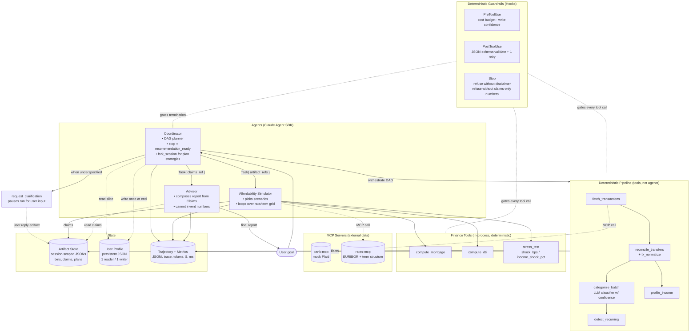
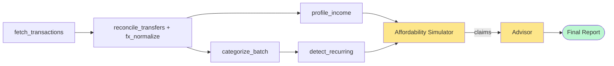

# Hackathon Plan — Agentic Budgeting & Affordability Advisor

## Context

Hackathon scenario 5 (Agentic Solution) requires the Claude Agent SDK. Our domain is **personal-finance budgeting + house-affordability advisory**: ingest transactions from (mocked) external bank APIs, learn the user's expense/income profile, then reason about complex goals like "can I afford a €350k house?" given current EURIBOR rates, fixed vs variable mortgage products, and the user's spending elasticity.

The hackathon weights production-readiness, architectural sophistication, and innovative SDK patterns (subagents, hooks, skills, `fork_session`, MCP). Evals are owned by another sub-team — this plan focuses solely on architecture.

**Locked decisions:**
- Data: synthetic generated transaction corpus.
- Stack: Python + Claude Agent SDK.
- Geography: EU / Italy — EURIBOR-indexed variable + fixed mortgage products.

---

## Design principles (revised after critique)

1. **Agency must be earned.** A node is a *subagent* only if it loops, picks tools, and reasons under uncertainty. Pure ETL with one LLM classification call is a *tool*, not an agent. We keep three agents: **Coordinator, Affordability Simulator, Advisor**. Everything else is a deterministic pipeline tool.
2. **Pass references, not payloads.** Specialists write artifacts to a session-scoped store and pass identifiers in `Task()` context. Raw transactions never re-enter coordinator context.
3. **Every number is a Claim.** Numeric outputs cross agent boundaries as structured `Claim` objects with provenance, never as prose. Advisor composes language *around* claims and cannot invent numbers.
4. **DAG, not fan-out.** Specialist invocations follow an explicit dependency graph; partial re-runs are possible (e.g. re-categorize without re-profiling income).
5. **One writer per store.** Profile store is read by Coordinator once at session start; written once at session end. No specialist writes to persistent state.
6. **Ask, don't guess.** Underspecified goals trigger `request_clarification`; the run pauses for user input rather than committing to assumptions.
7. **Spot rate + shocks, no forecasting.** Rate tool returns spot + a stress-shock parameter. We never claim to forecast 20-year rate curves.

---

## Holes from v1 — and how this version addresses them

| Original flaw | Resolution in this version |
|---|---|
| Over-agentification of ETL steps | Ingestion / Categorizer / Habit / Income demoted to deterministic tools. Only Coordinator + Affordability + Advisor remain agents. |
| Context bloat through coordinator | **Artifact Store** (session-scoped JSON files); only artifact IDs flow through `Task()` context. |
| Citation chain breaks at Advisor | **Claim object standard** crossing every agent boundary: `{value, unit, source_tool, source_args, confidence, ts}`. Advisor refuses to emit any number not present as a Claim. |
| `fork_session` was misframed | Reframed: forks compare divergent *plans* ("optimize lowest monthly payment" vs "fastest payoff"), each with different tool sequences — not parameter sweeps. |
| No DAG / dependency model | Coordinator runs an explicit DAG (below); declares inputs/outputs per node; supports partial re-runs. |
| No clarification loop | `request_clarification` tool pauses the run; user input is logged as a structured artifact and feeds the planner. |
| Multi-account / FX silent | Explicit `reconcile_transfers` step (nets inter-account transfers) and `fx_normalize` step before categorization. |
| Profile read-broadcast / write-races | Coordinator reads once, slices, passes only relevant fields. Single writer at session end. |
| Rate snapshot misleading for 20y mortgages | Tool returns `{spot, term_structure_snapshot}` and exposes `stress_test(shock_bps)`; framing in tool description is explicit about no-forecast. |
| MCP boundary arbitrary | Both **external-data** sources behind MCP: `bank-mcp` and `rates-mcp`. Internal finance math stays in-process. Pattern is now consistent. |
| Observability eval-only | Runtime **Trajectory + Metrics sink** (JSONL traces, token/cost counters, latency) emitted on every tool call and agent turn. |

---

## Architecture

### Component diagram



### DAG of a typical affordability run



Yellow = agentic (loops, picks tools). Green = user-facing output. Everything else is deterministic and individually re-runnable.

### The `Claim` object — the spine of the system

Every numeric value that crosses an agent boundary is a `Claim`. The Advisor accepts `Claim`s only; any prose number not backed by a `Claim` is rejected by the `Stop` hook before the report is returned.

```python
class Claim(TypedDict):
    id: str                    # stable, e.g. "claim_dti_2026_04"
    value: float | int
    unit: str                  # "EUR/month", "%", "bps", "ratio"
    label: str                 # "monthly_dti", "max_affordable_principal"
    source_tool: str           # "compute_dti"
    source_args: dict          # exact args passed
    inputs: list[str]          # other Claim ids this depends on
    confidence: float          # 0..1
    ts: str                    # ISO8601
```

The Advisor's contract: produce Markdown with inline references like `[claim_dti_2026_04]`. A post-processor swaps these for human-readable values during render. This makes faithfulness mechanically checkable, not vibes-checkable.

### Coordinator behavior

- **Read** user profile slice; load active goal; check whether the goal is fully specified (city, target price range, term, down payment, fixed-vs-variable preference). If anything is missing → `request_clarification` and pause.
- **Plan**: select DAG nodes needed for this goal. Affordability questions need the full DAG; "how am I spending?" only needs A→B→C→E.
- **Execute** DAG nodes; each node writes its artifact and returns the artifact id.
- **Fork** (when goal is open-ended): `fork_session` for two plan strategies — *minimize-monthly-payment* vs *minimize-total-interest*. Each fork runs Affordability with different scenario priors and produces its own claims set. Coordinator picks the better-grounded result (more claims, fewer low-confidence ones) or presents both.
- **Stop signal**: emit `recommendation_ready` only when Advisor returns a report whose claims all have confidence ≥ threshold AND disclaimer is present. Otherwise loop back with a targeted re-run.
- **Write** profile updates once at end (e.g. learned categories, observed recurring expenses).

### Memory model

- **Artifact Store** (session): `./.session/<session_id>/{transactions,categorized,recurring,income_profile,claims,plans}.json`. Lives for the run; cleaned up after.
- **User Profile** (persistent): `./profiles/<user_id>.json`. One reader (Coordinator at start), one writer (Coordinator at end). Diffed write — never blind overwrite.
- **Trajectory + Metrics** (append-only): `./.traces/<session_id>.jsonl`. Used for observability and (separately) by the eval team.

### Hooks

| Hook | Behavior |
|---|---|
| `PreToolUse` | Block if session token spend > budget. Block `update_user_profile` writes when patch confidence < 0.8. Block tool calls with malformed args before they hit the tool. |
| `PostToolUse` | Validate every structured tool output against its JSON Schema. On failure, inject the validation error and trigger a single retry; if it fails twice, raise. |
| `Stop` | Reject termination unless: (a) disclaimer present, (b) every numeric token in the final report is bound to a `Claim`, (c) `recommendation_ready` flag set by Coordinator. |

### Three-level `CLAUDE.md`

- **User-level** (`~/.claude/CLAUDE.md`): personal style.
- **Project-level** (`./CLAUDE.md`): "no number without a Claim", "no advice — only informational scenarios", DAG conventions, artifact-store path layout.
- **Directory-level** (`./agents/CLAUDE.md`): subagent authoring conventions (Task input/output schemas, Claim emission rules).

---

## Repo layout

```
README.md
CLAUDE.md
presentation.html
agents/
  coordinator.py            # DAG planner, fork strategy, stop logic
  affordability.py          # scenario picker, loops over rate/term grid
  advisor.py                # claims-only report composer
  CLAUDE.md
pipeline/                   # deterministic tools, not agents
  fetch.py                  # wraps bank-mcp client
  reconcile.py              # inter-account transfer netting + FX
  categorize.py             # LLM batch classifier with confidence
  recurring.py              # rule + statistical recurring detection
  income.py                 # stability score, source attribution
finance/
  mortgage.py               # compute_mortgage, compute_dti
  stress.py                 # rate / income shocks
  rates_client.py           # wraps rates-mcp
mcp_servers/
  bank_mcp.py               # mock Plaid-shaped server
  rates_mcp.py              # EURIBOR + term structure snapshot
state/
  artifact_store.py         # session-scoped JSON r/w
  profile_store.py          # persistent profile, single-writer
  trace.py                  # JSONL trajectory + metrics sink
hooks/
  pre_tool_use.py
  post_tool_use.py
  stop.py
schemas/
  claim.py                  # the Claim TypedDict + JSON Schema
  artifacts.py              # schemas for each artifact type
```

---

## Verification (architecture-level smoke checks)

1. Run a happy-path persona end-to-end; confirm trace shows DAG order A→B→{C,D}→E→F→G with no skipped nodes.
2. Confirm coordinator context never contains raw transactions (grep trace).
3. Inject a low-confidence categorization → confirm `update_user_profile` is blocked by PreToolUse hook.
4. Remove the disclaimer from Advisor output → confirm Stop hook blocks termination.
5. Insert a hand-edited number into the report not backed by any Claim → confirm Stop hook blocks termination.
6. Pull `rates-mcp` offline → confirm Affordability refuses to emit numeric Claims rather than hallucinating.
7. Run an underspecified goal ("can I buy a house?") → confirm `request_clarification` fires before any pipeline tool runs.
8. `fork_session` two strategies → confirm both produce independent claim sets and Coordinator picks one with rationale logged.

---

## Risks / open items

- **MCP overhead**: two MCP servers add startup latency for the demo. Mitigation: pre-warm both before the live run.
- **Claim post-processor brittleness**: report rendering depends on stable claim IDs. Mitigation: deterministic ID scheme `claim_<label>_<period>` + schema-validated.
- **Clarification UX in CLI demo**: pausing for user input in a non-interactive demo is awkward. Mitigation: support a `--prefilled-clarifications` flag for scripted demos; keep interactive mode for the live presentation.

---

## Development Plan

Build order is dependency-driven, not feature-driven. The goal is a **thin end-to-end slice running by end of Phase 4**, then deepen. Hooks, fork strategy, clarification loop, and polish layer on top of a working spine. Tooling: Python 3.11+, `claude-agent-sdk`, `mcp` (Anthropic MCP Python SDK), `pydantic` for schemas, `pytest` for unit tests.

### Workstreams

Three parallel tracks once Phase 0 is done. One developer per track keeps blast radius small.

- **Track A — Data & State**: synthetic generator coordination with eval team, artifact store, profile store, trace sink.
- **Track B — Tools & MCP**: MCP servers, deterministic pipeline tools, finance math.
- **Track C — Agents & Orchestration**: Coordinator, Affordability, Advisor, hooks, DAG executor.

Track C is the critical path. Most senior dev. Tracks A and B unblock C and should land first.

### Phase 0 — Foundations *(blocks everything; ~½ day, 1 dev)*

- Repo init, `pyproject.toml`, pin `claude-agent-sdk`, `mcp`, `pydantic`, `pytest`.
- `schemas/claim.py` — `Claim` Pydantic model + JSON Schema export.
- `schemas/artifacts.py` — schemas for each artifact type (`TransactionsArtifact`, `CategorizedArtifact`, `IncomeProfileArtifact`, `ClaimsArtifact`, `PlanArtifact`).
- `state/artifact_store.py` — `put(session_id, name, payload) -> ref`, `get(ref) -> payload`, atomic writes.
- `state/profile_store.py` — `read_slice(user_id, fields)`, `write_diff(user_id, patch)` with single-writer assertion.
- `state/trace.py` — JSONL append sink, used by hooks and agents.
- Project-level `CLAUDE.md` skeleton with the rules: "no number without a Claim," "no advice — only informational scenarios."
- One synthetic persona checked in (`data/personas/p001.json`) — minimum to develop against; eval team will expand.

**Exit criteria**: `pytest` green on store + schema round-trips; one persona loadable.

### Phase 1 — MCP servers *(unblocks Track B; ~½ day, 1 dev)*

- `mcp_servers/bank_mcp.py` — exposes `fetch_transactions(account_id, date_range)`. Reads from `data/personas/<id>.json`. Implements pagination so a 12-month pull doesn't return one giant blob.
- `mcp_servers/rates_mcp.py` — exposes `get_euribor(term)` returning `{spot, term_structure_snapshot}` from a static JSON snapshot. Tool description explicitly disclaims forecasting.
- Smoke client script `scripts/mcp_smoke.py` that connects to both, asserts schema-valid responses.

**Exit criteria**: `python scripts/mcp_smoke.py` returns expected payloads from both servers.

### Phase 2 — Deterministic pipeline tools *(parallel with Phase 3; ~1 day, 1 dev)*

Each tool: pure function, takes artifact ref(s) in, writes artifact out, returns ref. Each unit-tested against the synthetic persona with fixed seed.

1. `pipeline/fetch.py` — wraps `bank-mcp` client; produces `TransactionsArtifact`.
2. `pipeline/reconcile.py` — nets inter-account transfers (matches by amount/date/counter-account within tolerance), normalizes FX to EUR using a static rate table. Produces `ReconciledArtifact` + a side-channel of removed transfers for traceability.
3. `pipeline/categorize.py` — batched LLM classifier (direct Anthropic SDK call, not an agent). 15-category taxonomy, returns `(category, confidence)` per txn. Caches by merchant string. Produces `CategorizedArtifact`.
4. `pipeline/recurring.py` — combines a rule pass (same merchant + similar amount + monthly/biweekly cadence) with a simple statistical pass. Produces `RecurringArtifact`.
5. `pipeline/income.py` — flags credits as income vs transfers; computes 12-month stability score (CV of monthly inflows). Produces `IncomeProfileArtifact`.

**Exit criteria**: each pipeline step runs standalone via a CLI entrypoint (`python -m pipeline.<step> --session <id>`); artifacts validate against schemas.

### Phase 3 — Finance tools *(parallel with Phase 2; ~½ day, 1 dev)*

- `finance/mortgage.py` — `compute_mortgage(principal, rate_pct, term_years, type)`; supports fixed and EURIBOR-indexed (with margin). Returns monthly payment, total interest, amortization summary. Pure math, no LLM.
- `finance/stress.py` — `stress_test(scenario, rate_shock_bps, income_shock_pct)`; reruns mortgage + DTI under shocks.
- `finance/dti.py` — `compute_dti(monthly_income, monthly_debts)`.

**Exit criteria**: 100% unit-test coverage; reference values cross-checked against a public mortgage calculator.

### Phase 4 — Agents: vertical slice *(critical path; ~1.5 days, 1–2 devs)*

Build leaf-first so each agent has a clear contract before its caller is written. **Goal: end-to-end run on persona p001 produces a report. No fork, no clarification, no advanced hooks yet.**

1. **`agents/advisor.py`** — accepts `claims_ref`; reads claims from artifact store; produces a Markdown report with inline `[claim_id]` references. System prompt explicitly forbids inventing numbers. Output post-processor swaps claim IDs for human values.
2. **`agents/affordability.py`** — accepts `(income_profile_ref, recurring_ref, goal)`; loops over a small grid of (term, type) combinations; calls `compute_mortgage`, `compute_dti`, `stress_test`, `rates-mcp`; emits `ClaimsArtifact`. Stop condition: `scenarios_evaluated >= N AND best_scenario.confidence > threshold`.
3. **`agents/coordinator.py`** — minimum viable. Reads profile slice, runs the pipeline DAG, dispatches to Affordability via `Task()`, then Advisor via `Task()`. Returns final report. Hard-coded plan; no fork yet.

**Exit criteria**: `python -m agents.coordinator --user u001 --goal "afford €350k apartment in Milan"` produces a Markdown report with claim references on a clean run.

### Phase 5 — Hooks *(~½ day, 1 dev)*

Wire after the slice works — easier to debug guardrails when the underlying flow is known-good.

- `hooks/post_tool_use.py` — JSON-Schema validate every structured tool output; on failure, inject error + retry once.
- `hooks/pre_tool_use.py` — token-budget kill switch; block `update_user_profile` writes when patch confidence < 0.8; arg-shape validation.
- `hooks/stop.py` — reject termination unless: disclaimer present, every numeric token in report bound to a Claim, `recommendation_ready` flag set.

**Exit criteria**: each hook has a negative test (deliberately broken input) that proves it triggers.

### Phase 6 — Agentic depth *(~1 day, 1 dev)*

This is where "agentic" earns its name. Don't skip — judges will look for it.

- **`request_clarification` tool** — Coordinator detects underspecified goals (missing city / price / term / down payment); pauses run; user reply written as a structured artifact and re-fed to the planner.
- **`fork_session` plan strategies** — Coordinator forks into "minimize-monthly-payment" and "minimize-total-interest" branches, each with different scenario priors in Affordability. Comparison logic picks the better-grounded branch (more claims, fewer low-confidence) or returns both.
- **Partial re-run support** — Coordinator detects when only categorization needs to refresh (e.g. user re-asks within the same session); skips upstream nodes whose artifacts are still valid.

**Exit criteria**: ambiguous goal triggers clarification; full goal triggers fork and chooses; second run with same persona reuses cached artifacts.

### Phase 7 — Observability & deliverables *(~1 day, all)*

Mandatory hackathon files + runtime polish.

- Trace sink wired to every tool call and agent turn (token counts, latency, cost). One-line summary at end of run: nodes executed, $/tokens spent, stop reason.
- **`README.md`** — what was built, key decisions (with the v1→v2 architecture critique as appendix — judges value visible decision-making), run instructions, demo script.
- **`CLAUDE.md`** three-level (user / project / `agents/`).
- **`presentation.html`** — built with Claude Code, as the brief mandates. Static page summarizing architecture (embed the Mermaid diagrams), the Claim spine, demo walkthrough.

**Exit criteria**: a fresh clone runs the demo with `python -m agents.coordinator --demo`.

### Phase 8 — Demo prep *(~½ day)*

- Pre-warm both MCP servers before live run; latency budget verified.
- Scripted demo path with two personas: one happy-path, one underspecified-goal-triggers-clarification.
- Pre-recorded fallback video in case live demo network glitches.

### Critical-path summary

| Phase | Days (cum.) | Critical-path? |
|---|---|---|
| 0 — Foundations | 0.5 | yes |
| 1 — MCP servers | 1.0 | yes |
| 2 — Pipeline tools | 2.0 | yes (parallel with 3) |
| 3 — Finance tools | 1.5 | no (parallel with 2) |
| 4 — Agents (slice) | 3.5 | yes |
| 5 — Hooks | 4.0 | no |
| 6 — Agentic depth | 5.0 | yes — judging value |
| 7 — Deliverables | 6.0 | yes — mandatory |
| 8 — Demo prep | 6.5 | yes |

If time slips, **drop Phase 5 hooks first** (replace with inline asserts) and **trim Phase 6** to clarification only (no fork). Never drop Phase 7 — the README/CLAUDE.md/presentation.html are graded artifacts.

### Definition of done (per file/component)

- Has a Pydantic schema if it produces structured output.
- Has at least one unit test.
- Logs to the trace sink if it runs at session time.
- Is referenced from `CLAUDE.md` if it changes how Claude works in the repo.
