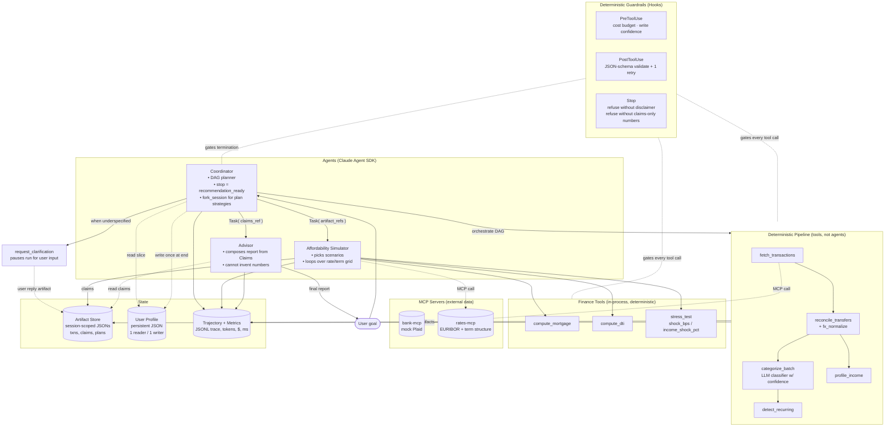
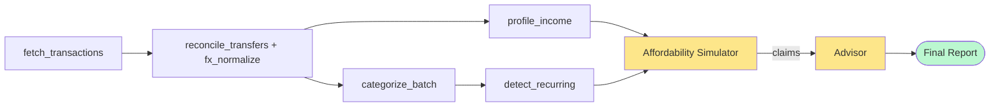

# Hackathon Plan – Agentic Budgeting & Affordability Advisor

## Context

Hackathon scenario 5 (Agentic Solution) requires the Claude Agent SDK. Our domain is **personal-finance budgeting + house-affordability advisory**: ingest transactions from (mocked) external bank APIs, learn the user's expense/income profile, then reason about complex goals like "can I afford a €350k house?" given current EURIBOR rates, fixed vs variable mortgage products, and the user's spending elasticity.

The hackathon weights production-readiness, architectural sophistication, and innovative SDK patterns (subagents, hooks, skills, `fork_session`, MCP). Evals are owned by another sub-team — this plan focuses solely on architecture.

**Locked decisions:**
- Data: synthetic generated transaction corpus.
- Stack: Python + Claude Agent SDK.
- Geography: EU / Italy — EURIBOR-indexed variable + fixed mortgage products.

---

## Design principles (revised after critique)

1. **Agency must be earned.** A node is a *subagent* only if it loops, picks tools, and reasons under uncertainty. Pure ETL with one LLM classification call is a *tool*, not an agent. We keep three agents: **Coordinator, Affordability Simulator, Advisor**. Everything else is a deterministic pipeline tool.
2. **Pass references, not payloads.** Specialists write artifacts to a session-scoped store and pass identifiers in `Task()` context. Raw transactions never re-enter coordinator context.
3. **Every number is a Claim.** Numeric outputs cross agent boundaries as structured `Claim` objects with provenance, never as prose. Advisor composes language *around* claims and cannot invent numbers.
4. **DAG, not fan-out.** Specialist invocations follow an explicit dependency graph; partial re-runs are possible (e.g. re-categorize without re-profiling income).
5. **One writer per store.** Profile store is read by Coordinator once at session start; written once at session end. No specialist writes to persistent state.
6. **Ask, don't guess.** Underspecified goals trigger `request_clarification`; the run pauses for user input rather than committing to assumptions.
7. **Spot rate + shocks, no forecasting.** Rate tool returns spot + a stress-shock parameter. We never claim to forecast 20-year rate curves.

---

## Holes from v1 — and how this version addresses them

| Original flaw | Resolution in this version |
|---|---|
| Over-agentification of ETL steps | Ingestion / Categorizer / Habit / Income demoted to deterministic tools. Only Coordinator + Affordability + Advisor remain agents. |
| Context bloat through coordinator | **Artifact Store** (session-scoped JSON files); only artifact IDs flow through `Task()` context. |
| Citation chain breaks at Advisor | **Claim object standard** crossing every agent boundary: `{value, unit, source_tool, source_args, confidence, ts}`. Advisor refuses to emit any number not present as a Claim. |
| `fork_session` was misframed | Reframed: forks compare divergent *plans* ("optimize lowest monthly payment" vs "fastest payoff"), each with different tool sequences — not parameter sweeps. |
| No DAG / dependency model | Coordinator runs an explicit DAG (below); declares inputs/outputs per node; supports partial re-runs. |
| No clarification loop | `request_clarification` tool pauses the run; user input is logged as a structured artifact and feeds the planner. |
| Multi-account / FX silent | Explicit `reconcile_transfers` step (nets inter-account transfers) and `fx_normalize` step before categorization. |
| Profile read-broadcast / write-races | Coordinator reads once, slices, passes only relevant fields. Single writer at session end. |
| Rate snapshot misleading for 20y mortgages | Tool returns `{spot, term_structure_snapshot}` and exposes `stress_test(shock_bps)`; framing in tool description is explicit about no-forecast. |
| MCP boundary arbitrary | Both **external-data** sources behind MCP: `bank-mcp` and `rates-mcp`. Internal finance math stays in-process. Pattern is now consistent. |
| Observability eval-only | Runtime **Trajectory + Metrics sink** (JSONL traces, token/cost counters, latency) emitted on every tool call and agent turn. |

---

## Architecture

### Component diagram



### DAG of a typical affordability run



Yellow = agentic (loops, picks tools). Green = user-facing output. Everything else is deterministic and individually re-runnable.

### The `Claim` object — the spine of the system

Every numeric value that crosses an agent boundary is a `Claim`. The Advisor accepts `Claim`s only; any prose number not backed by a `Claim` is rejected by the `Stop` hook before the report is returned.

```python
class Claim(TypedDict):
    id: str                    # stable, e.g. "claim_dti_2026_04"
    value: float | int
    unit: str                  # "EUR/month", "%", "bps", "ratio"
    label: str                 # "monthly_dti", "max_affordable_principal"
    source_tool: str           # "compute_dti"
    source_args: dict          # exact args passed
    inputs: list[str]          # other Claim ids this depends on
    confidence: float          # 0..1
    ts: str                    # ISO8601
```

The Advisor's contract: produce Markdown with inline references like `[claim_dti_2026_04]`. A post-processor swaps these for human-readable values during render. This makes faithfulness mechanically checkable, not vibes-checkable.

### Coordinator behavior

- **Read** user profile slice; load active goal; check whether the goal is fully specified (city, target price range, term, down payment, fixed-vs-variable preference). If anything is missing → `request_clarification` and pause.
- **Plan**: select DAG nodes needed for this goal. Affordability questions need the full DAG; "how am I spending?" only needs A→B→C→E.
- **Execute** DAG nodes; each node writes its artifact and returns the artifact id.
- **Fork** (when goal is open-ended): `fork_session` for two plan strategies — *minimize-monthly-payment* vs *minimize-total-interest*. Each fork runs Affordability with different scenario priors and produces its own claims set. Coordinator picks the better-grounded result (more claims, fewer low-confidence ones) or presents both.
- **Stop signal**: emit `recommendation_ready` only when Advisor returns a report whose claims all have confidence ≥ threshold AND disclaimer is present. Otherwise loop back with a targeted re-run.
- **Write** profile updates once at end (e.g. learned categories, observed recurring expenses).

### Memory model

- **Artifact Store** (session): `./.session/<session_id>/{transactions,categorized,recurring,income_profile,claims,plans}.json`. Lives for the run; cleaned up after.
- **User Profile** (persistent): `./profiles/<user_id>.json`. One reader (Coordinator at start), one writer (Coordinator at end). Diffed write — never blind overwrite.
- **Trajectory + Metrics** (append-only): `./.traces/<session_id>.jsonl`. Used for observability and (separately) by the eval team.

### Hooks

| Hook | Behavior |
|---|---|
| `PreToolUse` | Block if session token spend > budget. Block `update_user_profile` writes when patch confidence < 0.8. Block tool calls with malformed args before they hit the tool. |
| `PostToolUse` | Validate every structured tool output against its JSON Schema. On failure, inject the validation error and trigger a single retry; if it fails twice, raise. |
| `Stop` | Reject termination unless: (a) disclaimer present, (b) every numeric token in the final report is bound to a `Claim`, (c) `recommendation_ready` flag set by Coordinator. |

### Three-level `CLAUDE.md`

- **User-level** (`~/.claude/CLAUDE.md`): personal style.
- **Project-level** (`./CLAUDE.md`): "no number without a Claim", "no advice — only informational scenarios", DAG conventions, artifact-store path layout.
- **Directory-level** (`./agents/CLAUDE.md`): subagent authoring conventions (Task input/output schemas, Claim emission rules).

---

## Repo layout

```
README.md
CLAUDE.md
presentation.html
agents/
  coordinator.py            # DAG planner, fork strategy, stop logic
  affordability.py          # scenario picker, loops over rate/term grid
  advisor.py                # claims-only report composer
  CLAUDE.md
pipeline/                   # deterministic tools, not agents
  fetch.py                  # wraps bank-mcp client
  reconcile.py              # inter-account transfer netting + FX
  categorize.py             # LLM batch classifier with confidence
  recurring.py              # rule + statistical recurring detection
  income.py                 # stability score, source attribution
finance/
  mortgage.py               # compute_mortgage, compute_dti
  stress.py                 # rate / income shocks
  rates_client.py           # wraps rates-mcp
mcp_servers/
  bank_mcp.py               # mock Plaid-shaped server
  rates_mcp.py              # EURIBOR + term structure snapshot
state/
  artifact_store.py         # session-scoped JSON r/w
  profile_store.py          # persistent profile, single-writer
  trace.py                  # JSONL trajectory + metrics sink
hooks/
  pre_tool_use.py
  post_tool_use.py
  stop.py
schemas/
  claim.py                  # the Claim TypedDict + JSON Schema
  artifacts.py              # schemas for each artifact type
```

---

## Verification (architecture-level smoke checks)

1. Run a happy-path persona end-to-end; confirm trace shows DAG order A→B→{C,D}→E→F→G with no skipped nodes.
2. Confirm coordinator context never contains raw transactions (grep trace).
3. Inject a low-confidence categorization → confirm `update_user_profile` is blocked by PreToolUse hook.
4. Remove the disclaimer from Advisor output → confirm Stop hook blocks termination.
5. Insert a hand-edited number into the report not backed by any Claim → confirm Stop hook blocks termination.
6. Pull `rates-mcp` offline → confirm Affordability refuses to emit numeric Claims rather than hallucinating.
7. Run an underspecified goal ("can I buy a house?") → confirm `request_clarification` fires before any pipeline tool runs.
8. `fork_session` two strategies → confirm both produce independent claim sets and Coordinator picks one with rationale logged.

---

## Risks / open items

- **MCP overhead**: two MCP servers add startup latency for the demo. Mitigation: pre-warm both before the live run.
- **Claim post-processor brittleness**: report rendering depends on stable claim IDs. Mitigation: deterministic ID scheme `claim_<label>_<period>` + schema-validated.
- **Clarification UX in CLI demo**: pausing for user input in a non-interactive demo is awkward. Mitigation: support a `--prefilled-clarifications` flag for scripted demos; keep interactive mode for the live presentation.
